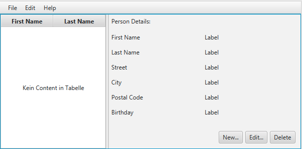
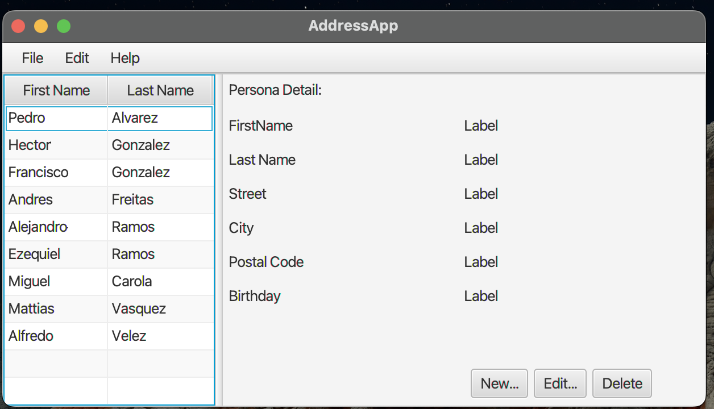
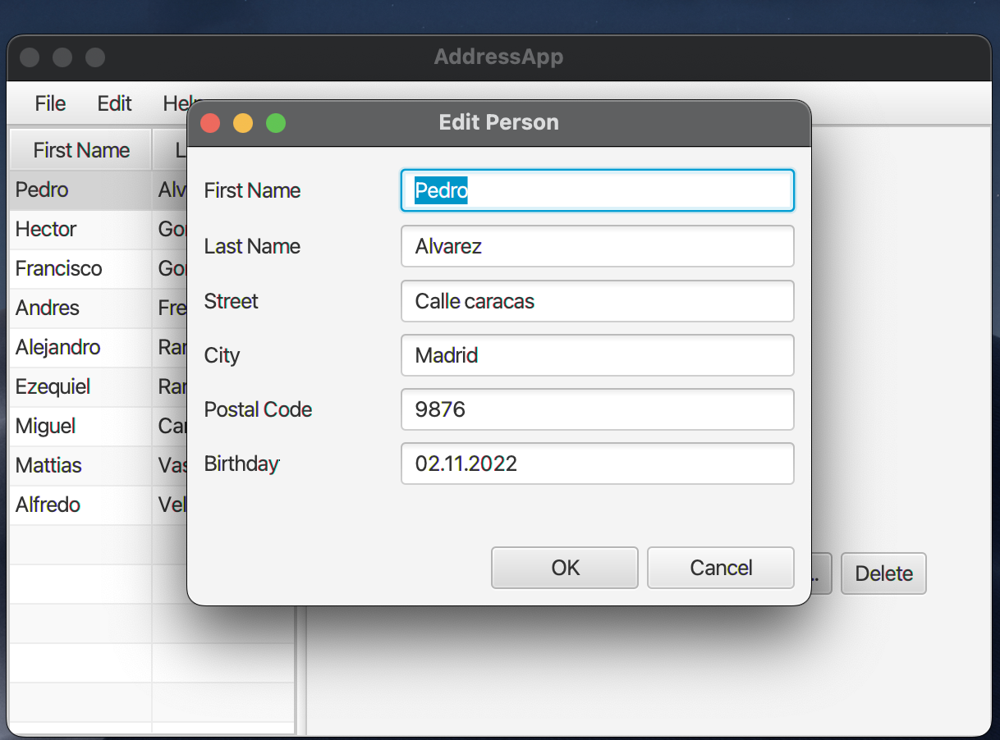
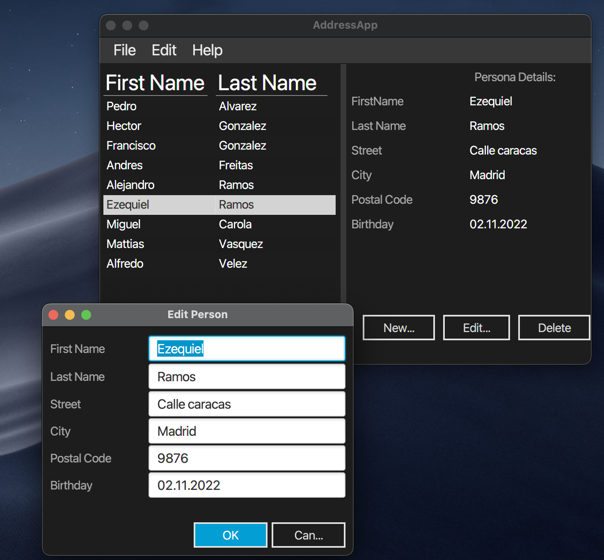

# Simple project to practice using JavaFx.

## Step 1

***Scene Builder***

_______________________________________________________________________________________________________

## Step 2

***Model y TableView***

_______________________________________________________________________________________________________

## Step 3 

***New_Edit_Delete Contact***

_______________________________________________________________________________________________________

## Step 4

***Style sheet***

