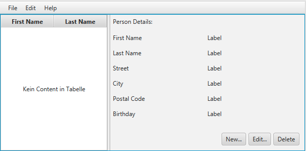
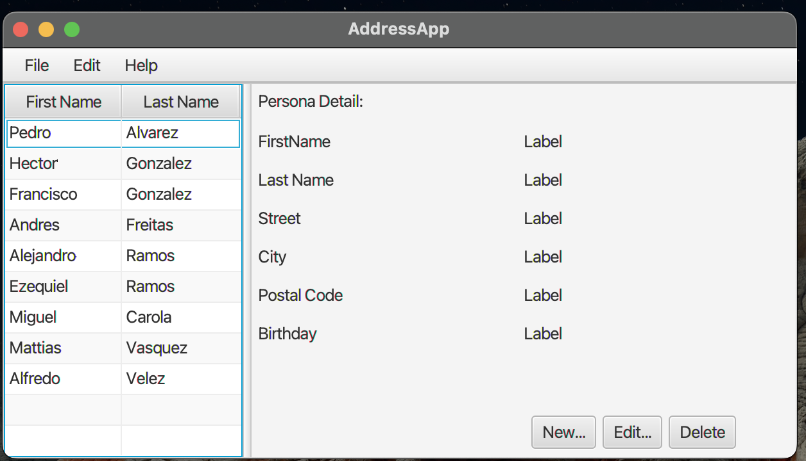

# Actividad 3 Desarrollo de Interfas con JavaFX

## Paso 1

***Parte 1: Scene Builder***

_______________________________________________________________________________________________________

## Parte 2

***Parte 2: Modelo y TableView***

_______________________________________________________________________________________________________
